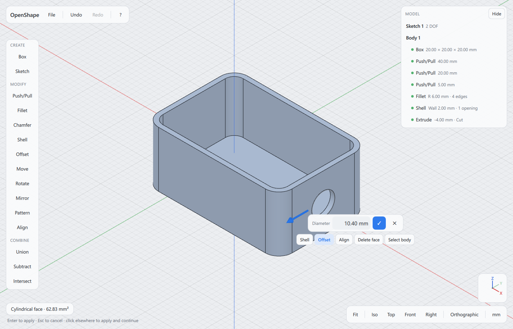
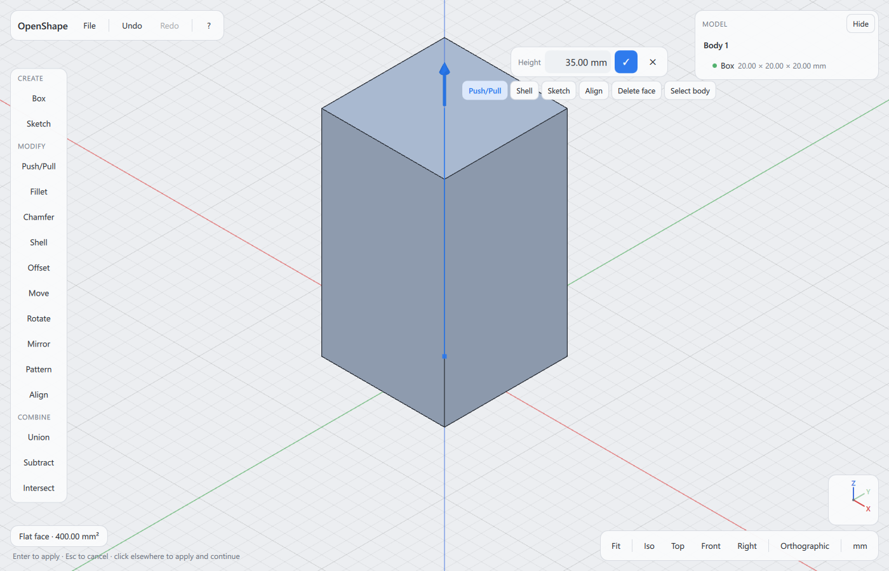
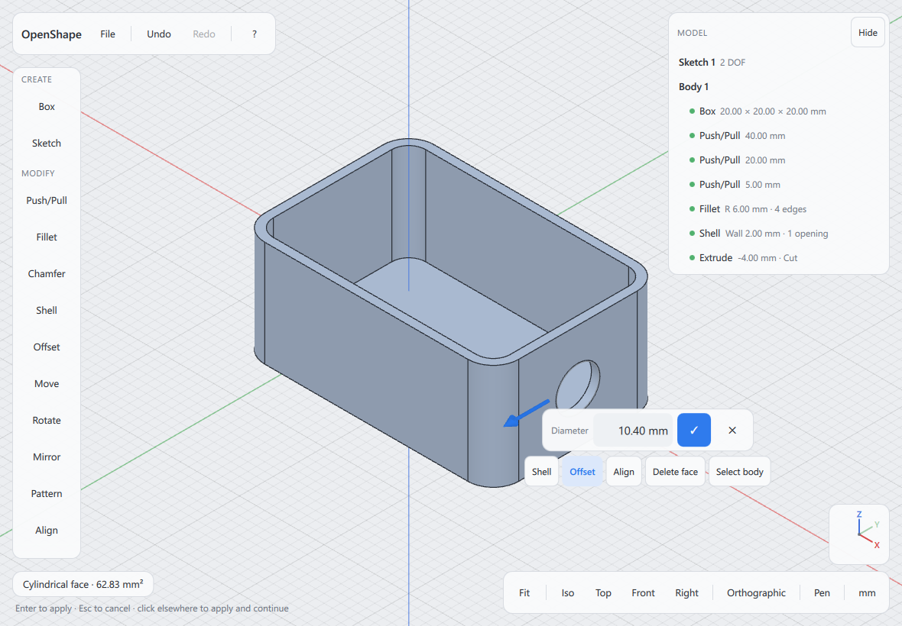
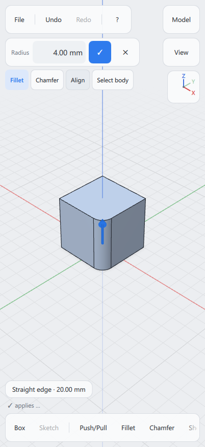
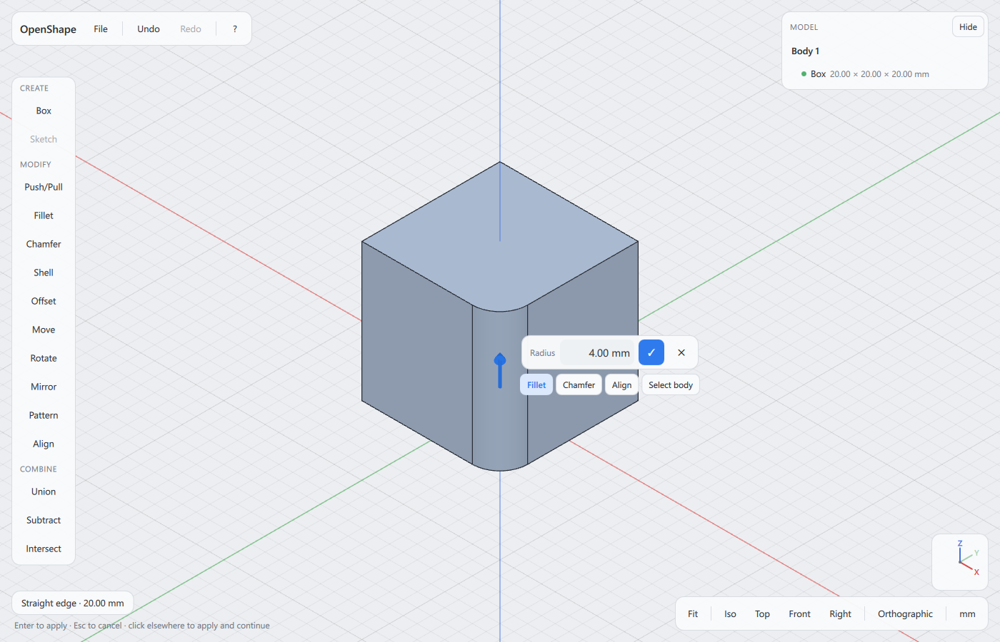
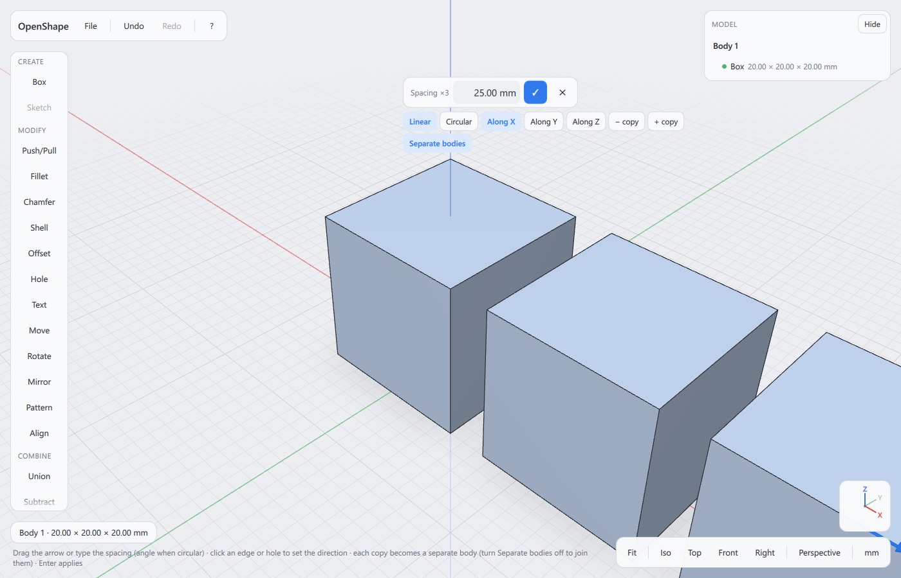
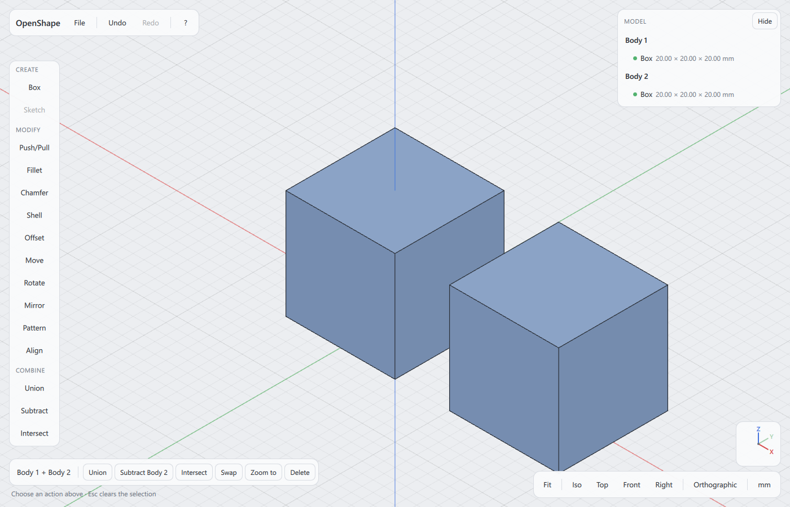
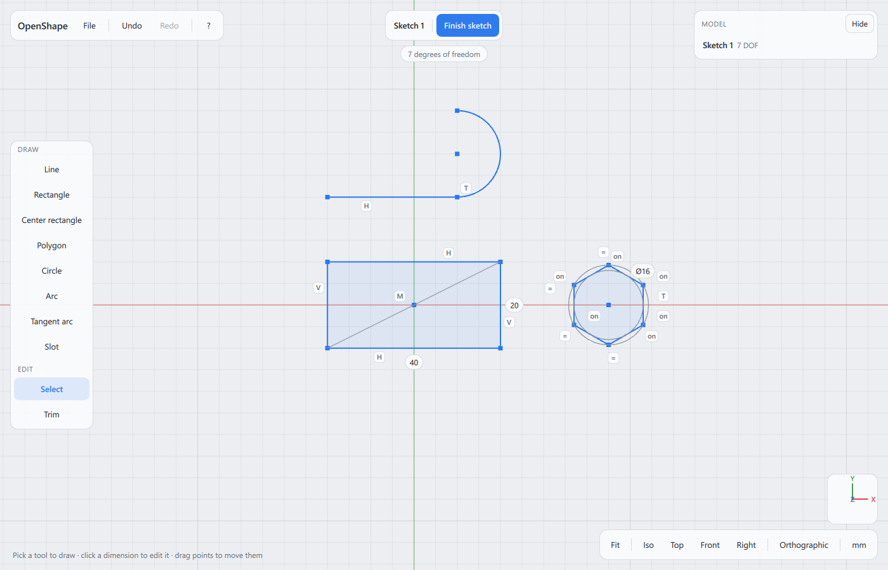
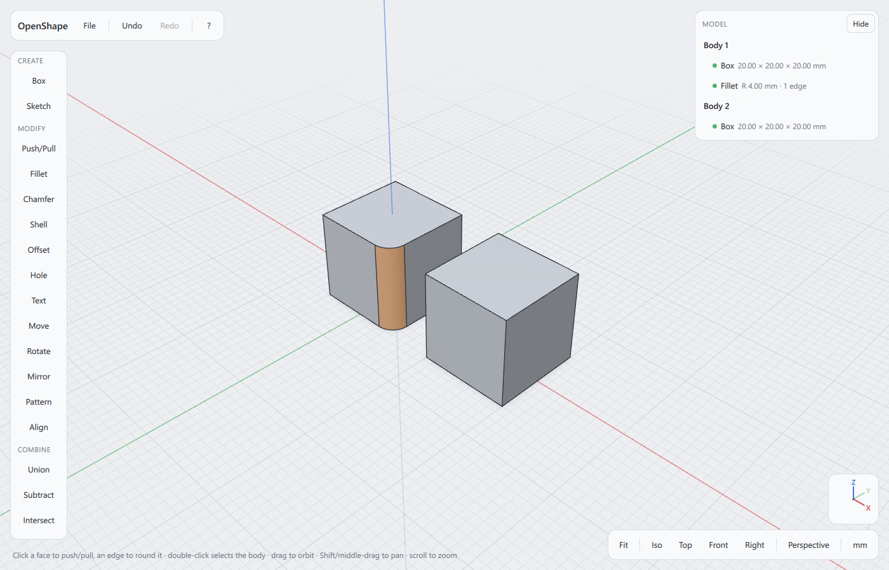

# OpenShape user guide

OpenShape is a direct-modeling CAD program for makers and 3D printing: you
shape a part by pushing and pulling its faces, rounding its edges and
sketching profiles to extrude, and you type exact sizes whenever you want
them. This guide describes OpenShape on Windows, iPhone and iPad (the iPhone
and iPad app is being tested through TestFlight). The same summary is in the
app: press `F1` or the **?** button.

The guide lives with the source code. The copy on GitHub's `main` branch
(the one the in-app card links to) follows the newest development version;
the copy that matches a release is in that release's source, under its tag
(listed on the [Releases page](https://github.com/SamuelAirs/openshape/releases)).
**File → About OpenShape** shows which version you have.



## Contents

1. [Getting started](#getting-started)
2. [Navigating the view](#navigating-the-view)
3. [Selecting](#selecting)
4. [Modeling](#modeling)
5. [Bodies](#bodies)
6. [Sketching](#sketching)
7. [The Model panel](#the-model-panel)
8. [Measuring](#measuring)
9. [3D printing](#3d-printing)
10. [Files, recovery and preferences](#files-recovery-and-preferences)
11. [Keyboard shortcuts](#keyboard-shortcuts)
12. [Troubleshooting and bug reports](#troubleshooting-and-bug-reports)

---

## Getting started

### Install

1. Download `OpenShape-<version>-windows-x64-setup.exe` from the
   [Releases page](https://github.com/SamuelAirs/openshape/releases). There
   is also a `.zip`: extract it anywhere and run `OpenShape.exe` inside, no
   installation needed.
2. Run the installer. Each release's notes say whether it is code-signed;
   if it is not, Windows SmartScreen may say "Windows protected your PC":
   click **More info**, then **Run anyway**.
3. It installs for your user only, without administrator rights, into
   `%LOCALAPPDATA%\Programs\OpenShape`, adds OpenShape to the Start menu
   (and, if you tick the box on the last page, to the desktop) and opens
   `.openshape` files when you double-click them.

Installing a newer version over an older one replaces it. To remove
OpenShape, use *Settings → Apps → Installed apps*; your projects and
settings stay.

### The screen



On a desktop-sized window:

- **Top bar** (top left): the **File** menu, **Undo** and **Redo** (their
  tooltips name the step), and **?** for the help card.
- **Tool palette** (left): **Create** (Box, Sketch), **Modify**
  (Push/Pull, Fillet, Chamfer, Shell, Offset, Hole, Text, Move, Rotate,
  Mirror, Pattern, Align), **Combine** (Union, Subtract, Intersect) and
  **Construct** (Axis, Plane). When the window is short, the palette
  scrolls.
- **Model panel** (right): everything you made, step by step. It appears
  once there is something in the document; **Hide** folds it away (**Show**
  brings it back; on a phone, **Close** slides it away). See
  [The Model panel](#the-model-panel).
- **Value box** (next to the arrow or ring you are dragging, never over
  what you selected, nor where you are moving, turning or copying it, the
  arrow or the spot you tapped; on a phone it sits
  below the top bar or above the hint, on the side away from the
  selection, and stays there while you drag; while you type a value it
  sits below the top bar, above the keyboard): the name of
  the value (Height, Radius, Diameter …), the value itself, **✓** to apply,
  **✕** to cancel, and below it the other things you can do with the
  current selection (for example Push/Pull, Shell, Sketch, Align, Delete
  face, Select body).
- **Selection and hint** (bottom left): what is selected (a face's area, an
  edge's length, a body's size) and a line saying what you can do next.
  When something cannot be done, the reason appears there or under the
  value box in red.
- **View buttons** (bottom right): **Fit**, **Iso**, **Top**, **Front**,
  **Right**, the projection (**Perspective**, the default, or
  **Orthographic**; click to switch, and OpenShape remembers your choice),
  **Pen** (in the touch layout) and the display unit (**mm** or
  **in**; click to switch). Above them, the axis marker shows which way X
  (red), Y (green) and Z (blue, up) point.
- Short messages ("Saved", "Exported STL", or why something failed) appear
  at the bottom of the window for a few seconds.

When OpenShape starts without a file it shows [Home](#projects) with your
recent projects: click **New project** for an empty document. A new document
is empty: click **Box** (or press `B`) to start with a 20 mm cube, or press
`K` (or click **Sketch**, then **Top (XY) — ground**) to draw a profile on the
ground.

### How tools work

- **Select first, then act.** Click a face, an edge or a body, and the
  things you can do with it appear next to it. The first one is already
  active: click a flat face and you are pushing or pulling it; click an
  edge and you are rounding it.
- **Or pick a tool first.** A tool in the palette runs on what is selected
  if it fits; otherwise the hint line says what to select.
- **Drag or type.** Drag the arrow (or ring) and watch the preview, or just
  start typing a number: it goes straight into the value box. Press `Enter`
  or **✓** to apply, `Esc` or **✕** to cancel. Clicking somewhere else
  applies the pending value too, then selects what you clicked.
- **Previews never change your model.** Only an applied step does, and
  every applied step can be undone (`Ctrl+Z`) and changed later in the Model
  panel.

### Typing values

Lengths accept units and arithmetic everywhere: in the value box, in
sketch dimensions and in the Model panel. Without a unit they are in the
display unit (**mm** or **in**, bottom right). Angles are in degrees.

| You type | Means |
|---|---|
| `25` | 25 in the display unit |
| `1in`, `1"`, `2.5cm`, `2,5cm`, `0.1m`, `25mm` | that length in any unit |
| `20+5`, `(10+2)*3`, `100/4` | the result |
| `+5`, `-5` (in a size like Height) | 5 more or 5 less than now |
| `90`, `90deg`, `90°`, `1.5rad` (angles in the value box) | an angle |

---

## Navigating the view

| | Mouse | Touch | Pen mode |
|---|---|---|---|
| Orbit | drag with the left or right button | drag one finger | one finger |
| Pan | `Shift`+drag, or drag with the middle button | drag two fingers | two fingers |
| Zoom | mouse wheel (toward the pointer) | pinch | pinch |
| Undo / redo | `Ctrl+Z` / `Ctrl+Y` | tap with two / three fingers | two / three fingers |

- Orbiting turns around the point under the pointer, so what you look at
  stays in place. Zooming (wheel or pinch) heads for what is under the
  pointer.
- **Fit** (or `F`) shows everything; **Zoom to** (in a selected body's
  actions) shows that body.
- **Iso**, **Top**, **Front** and **Right** turn the view to the standard
  directions (Front looks along +Y, Right looks along −X); the grid is the
  ground (the XY plane, fading out towards its edge), Z points up. The
  light comes from above and turns with you as you orbit, staying over
  your left shoulder: tops are lighter than the sides and undersides
  darkest from every angle, two sides of a box seen at once get clearly
  different shades, and a body resting flat on the grid casts a soft
  shadow beneath it.
- Dragging an arrow or a ring changes a value instead of turning the view.

**Touch layout.** The first time you touch the screen, OpenShape switches
to larger buttons and shows the **Pen** button. With a pen, the pen selects
and draws and your fingers only move the view, so a hand resting on the
screen does nothing; OpenShape turns this on when it first sees a pen, and
**Pen** switches it on or off. Nothing needs hovering, a right-click or a
modifier key: taps add to the selection (tap empty space to start over), a
double-tap selects a body (another double-tap adds the next one), and
every tool has a button. On an iPad the touch layout is on from the start.

**On a phone** (or any window narrower than about 600 px or lower than
about 500 px, such as an iPad in Split View), the tools move to a strip along the bottom that scrolls
sideways, the Model panel and the view buttons open from the **Model** and
**View** buttons, and nothing sits under the camera cutout or the home
indicator. The value box docks at the top or the bottom of the screen, on
the side away from what you selected, and moves to the top while you type
with the on-screen keyboard. While you draw a sketch, the live sizes show
beside your finger, not under it.





---

## Selecting

| To select | Mouse | Touch |
|---|---|---|
| A face or an edge | click it (edges within a few pixels win) | tap it |
| More faces or edges | `Shift`+click (click again to remove one) | tap more (taps add) |
| A whole body | double-click it | double-tap it |
| A second body | `Shift`+double-click | double-tap it, or just tap it |
| A body out of several | `Shift`+double-click it | double-tap it (or tap it) |
| A sketch shape (profile) | click inside it | tap inside it |
| From the Model panel | click a body's row (`Shift` adds) | tap its row |
| Nothing | `Esc`, or click empty space | tap empty space |

- A selection is one kind at a time: clicking an edge while faces are
  selected starts a new selection.
- **Select body** (in the actions of a selected face or edge) selects the
  body it belongs to.
- `Ctrl`+click adds like `Shift`+click.
- **Two or more bodies on touch** (to combine them, say): double-tap one,
  then double-tap the next; each double-tap adds its body, and a double-tap
  on a selected body takes it out again. While bodies are selected a single
  tap on another body adds it too, and a tap on a selected one takes it out
  (tap empty space first to pick a face again). A tap beside the Move
  arrows, on another body, adds that body; right on an arrow it chooses the
  arrow. With two bodies selected, **Union**, **Subtract** and **Intersect**
  appear. The same works with a pen. In a tool that waits for a target
  (Mirror's plane, Align's target), a double-tap on a
  target picks it just as a tap does; it never applies the tool.

---

## Modeling

### Box

**Box** (or `B`) adds a 20 mm cube standing on the ground at the origin.
Push and pull its faces to give it any size.

### Push/Pull

Click a flat face: an arrow appears, and the value box shows the part's
size across that face to the parallel face behind it (**Height**, **Width**
or **Depth**, or **Thickness** for a slanted face; a thin blue line shows
what is measured).

- Drag the arrow, or type the new size and press `Enter`: `35` makes the
  part 35 mm tall.
- `+5` or `-5` makes it 5 mm bigger or smaller than it is now.
- If there is no parallel face behind it, the value is how far the face
  moves (**Distance**).
- Dragging snaps to round values that suit the zoom; hold `Alt` for free
  values.
- Pulling a face out adds material, pushing it in removes it (for example a
  pocket in the top of a block).
- Fillets and chamfers around the face keep their size and move with it
  when the walls they run along are straight; otherwise the face moves
  on its own.

### Fillet and chamfer

Click an edge (`Shift`+click more), then drag the arrow or type the radius
(**Fillet**) or the size (**Chamfer**) and press `Enter`. Switch between
the two with the buttons below the value box.



When a size is too large for the edges, the preview says so in red and,
where it can, names a size that works ("Try 1.9 mm or less").

### Shell

Click the face to open, choose **Shell** and type the wall thickness; the
body becomes hollow with that wall, open at that face. `Shift`+click opens
more faces (with several faces selected, Shell is what you get).

### Offset a face, resize a hole

- **Holes and shafts:** click the round wall of a hole (or a shaft): the
  value box shows its **Diameter**. Type the new one, for example with
  clearance for printing, and press `Enter`.
- **Other faces:** select a face and click **Offset** in the tool palette:
  the face moves by the typed distance and its neighbours follow. When they
  cannot follow (for example next to a rounded edge), OpenShape says so
  instead of making a broken part.

### Delete faces

Select the faces of a hole, a fillet, a chamfer or a boss and press
`Delete` (or click **Delete face**): the feature is removed and the
surrounding faces close the gap.

### Extrude and revolve (3D from a sketch)

Click inside a closed shape of a finished sketch (`Shift`+click adds more
shapes of the same sketch). An arrow appears:

- Drag or type a distance and press `Enter`. A sketch on the ground makes a
  new body.
- A sketch on a body's face joins the body when you pull out and cuts into
  it when you push in (type a negative value, e.g. `-5`). **New body**,
  **Join** and **Cut** choose explicitly. Once the extrude is a cut (a
  negative value, or **Cut** clicked), a **Through all** button appears; it
  cuts through the whole body whatever its thickness. (A join that would
  not touch the body makes a new body, and a cut that would remove nothing
  does too.)
- **Symmetric**: the value is the total thickness, half on each side of the
  sketch.
- **Up to face**: click a flat face parallel to the sketch; the extrusion
  ends there.
- **Draft**: click it and type an angle to taper the walls (positive
  narrows them away from the sketch, negative widens them); the button
  then shows the angle, and the arrow (or **Draft** again) goes back to the
  distance. The draft can be changed later in the Model panel.
- **Revolve** turns the shape around the sketch's own vertical or
  horizontal axis through its origin (**Axis: vertical** / **Axis:
  horizontal**); type the angle (`360` for a full turn).
- **Edit sketch** opens the sketch again.

---

## Bodies

A body is one solid part. Double-click a body (or click its row in the
Model panel) to select it; its actions appear below the value box.

### Move and rotate

- **Move** (active when you select a body): drag one of the X, Y, Z arrows,
  or type a distance for the highlighted arrow (click an arrow to choose
  it).
- **Rotate**: drag one of the three rings (15° steps; hold `Alt` for 1°) or
  type an angle. To turn about something else, click a straight edge, a
  hole or a [construction axis](#construction-axes-and-planes) (one ring
  appears around it), or click a corner or a circle (the rings move there).
  **Center pivot** puts them back.

### Align

Select the face or edge of the body you want to move, click **Align**, then
click what to line it up with:

- **A face or edge of another body:** faces end up touching, edges in line,
  a hole on a shaft.
- **The origin:** click one of the X (red), Y (green) or Z (blue) axis
  lines drawn through the origin, or choose **X axis**, **Y axis**, **Z
  axis**, **XY plane**, **XZ plane**, **YZ plane** or **Origin** in the row of
  buttons above the hint (in the value box once a target is chosen). A
  hole's axis (select its rim or its wall) lands on the Z axis, a
  straight edge runs along X, a flat face lies on the XZ plane touching it
  from the side the body is on (**Flip** puts the body on the other side),
  and a circle's center or an edge's middle moves onto the origin (the body
  only moves, it does not turn). The body goes the shortest way: onto the
  nearest point of the axis or plane.
- **A [construction axis or plane](#construction-axes-and-planes):** click
  it in the view; it works like the origin's axes and planes.

**Flip** turns it around, the arrow or a typed value adds an offset along
the target, and **Onto ground** lays the selected face flat on the ground
(the build plate). `Enter` applies. Align is stored as a move: it does not
follow the target when that changes later.

### Mirror and pattern



- **Mirror**: select a body, click **Mirror**, then click a flat face or a
  construction plane to mirror across, or choose **Across YZ**, **Across
  XZ** or **Across XY**.
  **Apply** (or `Enter`) adds the mirror image.
- **Pattern**: select a body, click **Pattern**. **Linear** repeats it in a
  row (**Along X/Y/Z**, or click an edge or a construction axis for the
  direction; the value is the spacing), **Circular** around an axis
  (**Around X/Y/Z**, or click a hole, a shaft or a construction axis; the
  value is the total angle, and 360° spaces the copies evenly). **+ copy**
  and **− copy** change how many (the number after × counts the original
  too).
- Copies that touch or overlap the original join it (a half part mirrored
  across its own face becomes one symmetric body). Copies that touch
  neither the original nor each other become **separate bodies**, each
  independent: changing or moving the original later changes no copy, and
  the other way round. The **Separate bodies** button shows which it will
  be; click it to switch. (Each copy of an imported STEP body stores its
  geometry again, and a project holds at most 512 MB of it: copies that
  would not fit stay joined, and Separate bodies says why.)

### Construction axes and planes

Reference geometry to model against: turn a body about an axis, repeat it
around one, mirror across a plane, align onto either, or sketch on a plane
that floats above a face. They are drawn in orange (an axis as a dashed
line, a plane as a see-through square with an outline), have their own rows
in the Model panel, and are saved with the project.

- **Axis** (in **Construct**): with **Through / along** (the starting
  mode), click a hole, a shaft or a circle (the axis goes through its
  middle) or a straight edge (along it). **Two points**:
  click two corners (an edge near its end) or circles (their centers).
  **Parallel to X / Y / Z**: click a corner or circle it goes through.
- **Plane**: with **Offset from face** (the starting mode), click a flat
  face, then drag the arrow or type the distance
  (negative goes the other way); **From XY / XZ / YZ** starts from an
  origin plane instead. **At angle**: click a straight edge, then type the
  angle to the face next to it (the one facing up; click another flat face
  along the edge to measure from that one): 0° is the face's own plane, 90°
  stands up across it. **Midway**: click two parallel flat faces.
- `Enter`, **Apply** or a click on empty space adds it; `Esc` goes back one
  pick. Something selected first (a hole's rim, an edge, a face, two
  parallel faces) is taken as the first pick.
- The new axis or plane is selected: **Sketch** puts a sketch on a plane
  (it moves with the plane), **Hide** and **Delete** are there too. Click
  one in the view to select it again.
- **Using them:** while Rotate, Pattern, Mirror or Align waits, click the
  axis or plane in the view. They use it where it is when you apply them.
- **They follow the part:** made from a face or edge, they move when an
  earlier step changes that face or edge (a plane 10 mm above the top of a
  box moves up when the box gets taller), and so do a sketch on the plane
  and what was extruded from it. Steps added after the axis or plane was
  made do not move it. If what it was made from is gone, its Model-panel row
  turns red and says why, and it stays where it was.
- **In the Model panel:** click the row to select it; an offset plane's
  distance and an angled plane's angle can be typed there; **Hide** /
  **Show** and **Delete**. A distance goes up to 1000 m either way, an
  angle from -180° to 180°.
- **Copies:** a separate copy of a body built on a plane made from that
  body (Duplicate, a separate Mirror or Pattern copy, a split piece) gets
  its own hidden copy of the plane, so changing the original never moves
  the copy. A plane made from another body or an origin plane is shared.

### Duplicate and split

- **Duplicate** (`Ctrl+D`, or in the body's Model-panel row) makes an
  independent copy in place and selects it with the Move arrows, ready to
  drag away.
- A body cut into separate pieces is marked in the Model panel; **Split
  into bodies** makes each piece its own, independent body (with a copy of
  the history it came from).

### Union, subtract, intersect



Select two or more bodies (double-click, then `Shift`+double-click; or in
the Model panel), then **Union** (join them), **Subtract** (cut the others
away from the body selected first) or **Intersect** (keep only what they
share). **Swap** exchanges which body is cut. Each is one step you can
undo.

### Deleting and hiding

Select a body and press `Delete` (or **Delete**). A body that other bodies
are built from (a subtracted tool body you showed again, or split pieces
and separate copies in projects saved by OpenShape 0.1) is hidden instead.
**Hide** and **Show** are in the body's Model-panel row. Hidden bodies are
not exported.

---

## Sketching

A sketch is a flat drawing on a plane; its closed shapes (profiles) become
3D with Extrude or Revolve.

### Starting a sketch

- **On the ground:** press `K`, or click **Sketch** and choose **Top (XY) — ground**.
  **Front (XZ)** and **Right (YZ)** are the upright origin planes.
- **On a face:** select a flat face, then press `K` or click **Sketch** (or
  **Sketch** below the value box). The sketch stays on that face when the
  part changes.
- **On a construction plane:** select it (click it in the view or its
  Model-panel row), then press `K` or click **Sketch**. The sketch moves
  with the plane.
- **Adding to a sketch:** select one of its shapes and press `K`, or start a
  sketch on the plane it lies on: new lines then split its shapes.
- **Editing a sketch later:** double-click one of its shapes, double-click
  its row in the Model panel, or use **Edit sketch**.

The view turns to face the sketch. At the top are the sketch's name,
**Finish sketch** and its status; the drawing tools are on the left.



### Drawing tools

| Tool | Key | How |
|---|---|---|
| Line | `L` | Click point after point; type a length. `Esc` or a right-click ends the line (on touch: tap the tool again); ending on the first point closes the shape. |
| Rectangle | `R` | Click one corner, then the opposite corner, or type width, `Tab`, height, `Enter`. You can also drag. |
| Center rectangle | `E` | Click the center, then a corner (or type width, `Tab`, height): it stays centered. |
| Polygon | `P` | Click the center, move to the middle of a side; type the size across flats (with an odd number of sides: the inner diameter, labelled inner Ø), `Tab` for the number of sides. `-` / `+` (or the **−** / **+** buttons) change the sides. |
| Circle | `C` | Click the center, then click for the size or type the diameter. |
| Arc | `A` | Click the start, the end, then where it bends (or type the radius). |
| Tangent arc | `G` | Click the free end of a line or arc, then where the arc ends (or type the radius); it continues from there until `Esc`. |
| Slot | `O` | Click both end centers, then move or type the width. |
| Select | `S` | Select points, lines and circles; drag points to move them. |
| Trim | `T` | Click the piece of a curve to cut away (it turns red first). |

- **Exact sizes while drawing:** just type; `Tab` moves to the next value
  (width → height), `Backspace` corrects, `Enter` applies.
- Points snap to other points, midpoints and the origin, and lines snap to
  horizontal and vertical (the constraint is added). Points away from other
  geometry snap to the grid, which follows the zoom (switch it off in
  **Preferences**).
- `Esc` stops the shape being drawn; a second `Esc` switches to Select; a
  third clears the selection.
- Letters only pick tools when nothing is being drawn (while drawing, they
  are units such as `in`).

### Editing a sketch

With the **Select** tool, select curves or points (`Shift` or taps add);
the actions for them appear at the bottom:

- **Delete** (or the `Delete` key) removes them.
- **Construction** turns curves into construction geometry: shown, used for
  constraints, never part of a shape.
- **Fillet** (with corner points selected) rounds the corner; click the
  **R** label to change the radius.
- **Offset** (curves): move to the side to offset to, then click or type a
  distance.
- **Mirror** (curves): then click the line to mirror across (a construction
  line works well). The copies stay mirrored (a Symmetric constraint).
- **Pattern** (curves): **Linear**: click where the next copy goes (or type
  the spacing); **Circular**: click the center and type the total angle.
  `Tab` for the count, `-` / `+` (or the **−** / **+** buttons) change it;
  **Apply** or `Enter`.

### Constraints and dimensions

Select one or two items; the constraints that fit appear at the bottom:

| Selection | Constraints |
|---|---|
| Lines | Horizontal, Vertical; one line: Length |
| Two lines | Parallel, Perpendicular, Equal, Angle |
| A circle / an arc | Diameter / Radius |
| Two circles or arcs | Equal, Concentric, Tangent |
| A line and a circle or arc | Tangent |
| Two points | Coincident, Horizontal distance, Vertical distance |
| A point and a line | On line, Midpoint |
| A point and a circle or arc | On circle |

- **Dimensions** (lengths, Ø diameters, R radii, angles in °) are labels on
  the sketch. Click one to type a new value; the sketch follows.
- **Constraint glyphs** sit next to the geometry: H horizontal, V vertical,
  ∥ parallel, ⊥ perpendicular, = equal, T tangent, ◎ concentric,
  ● coincident, M midpoint, *on* on a line or circle, ↔ symmetric. With the
  Select tool, click a glyph to select that constraint and press `Delete`
  (or **Delete constraint**) to remove it.
- **Status** (under the sketch name, and in the Model panel): "Fully
  defined" (green) when nothing can move any more, otherwise how many
  degrees of freedom are left. A change that would conflict with the
  existing constraints is refused with a message; nothing changes.

### Finishing

Click **Finish sketch**. Then click inside a closed shape to
[extrude or revolve](#extrude-and-revolve-3d-from-a-sketch) it. Every
sketch step can be undone, also after finishing.

---

## The Model panel



The Model panel lists your sketches, construction axes and planes, and
bodies, and under each body its steps in order (Box, Push/Pull, Fillet,
Shell, Extrude …) with their main values.

- **Hover a row** to see its geometry highlighted in the view.
- **Click a step** to open it: its values appear as fields; type a new value
  and press `Enter`, and the model is rebuilt with it (`Esc` leaves it).
  **Suppress** switches the step off without deleting it (**Restore**
  switches it back on); **Delete** removes it. The first step of a body
  cannot be suppressed or deleted.
- **Click a body** to select it (`Shift` adds another). Its row offers
  **Duplicate**, **Hide** / **Show** and **Delete**.
- **Sketches** show "Fully defined" or how many degrees of freedom (DOF)
  are left; open one with **Edit sketch** or a double-click. A sketch can be
  deleted when no step uses it.
- **Construction axes and planes** show what they are made from ("10.00 mm
  from a face", "Through a hole or shaft"). Clicking the row selects it; an
  offset or angle can be typed; **Hide** / **Show** and **Delete**.
- **Status dots:** green is fine, amber is a warning (for example a body in
  several pieces: **Split into bodies** appears), red failed, grey is
  suppressed or not computed.
- **When a step fails** after a change (for example a fillet that no longer
  fits), its row turns red and says why; the body shows the last good
  shape. Change the value, suppress or delete the step, or undo.

---

## Measuring

- **One flat face:** clicking it shows the size to the parallel face behind
  it in the value box (press `Esc` to leave it unchanged).
- **The selection line** (bottom left) shows a face's type and area, an
  edge's length (and radius for a circle), a body's overall size
  (W × D × H), or a sketch profile's area.
- **Two faces or edges** (`Shift`+click the second, on the same or another
  body): their distance and angle, or "Gap … · parallel" for two parallel
  faces.

---

## 3D printing

### Holes that fit

Printed holes often come out a little smaller than modeled, depending on
the printer. The screw sizes of the **Hole** tool, **Counterbore** and
**Countersink** therefore add a **hole allowance** of 0.2 mm to the
standard diameters (M3 close fit: 3.2 mm by ISO 273, drilled at 3.4 mm).
Change it in **File → Preferences… → Hole allowance for 3D printing**
(0 for the standard sizes, up to 1 mm); the **Tap** and heat-set insert
sizes already assume printed plastic and never get it. A diameter you type
is used exactly: click the hole's wall and type the diameter you need; the
Model panel keeps the value, so you can change it after a test print.

### Holes for screws

1. Click a flat face, then **Hole** (on the face's buttons, or in the
   Modify tools).
2. Click where each hole goes: clicks snap to the face's center and the
   middles of its straight edges, and line up with the holes placed so far.
3. Pick the screw size (**M2** … **M6**) and the fit: **Close fit** or
   **Normal fit** (ISO 273 clearance, plus the
   [hole allowance](#holes-that-fit)), or **Tap** (a tap drill, for a screw
   that cuts its own thread). Or click **Ø** and type a diameter.
4. **Through all** drills through the whole part; switch it off and click
   **Depth** to type a depth. **Counterbore** or **Countersink** adds a
   seat for the screw head.
5. For exact positions click **X** or **Y** (or press `Tab`) and type the
   distance from the face's corner; with two or more holes, **From last
   hole** measures from the hole placed before. Click a placed hole to make
   it the current one; **Remove hole** drops it.
6. Press `Enter` (or ✓): all the holes are one step in the Model panel
   (**Holes**, or **Hole** for a single one).

To add a seat to a hole that is already there, click its rim on the flat
face, then **Counterbore** or **Countersink**; pick **M2** … **M6** or type
the diameter. A counterbore's arrow into the hole sets its depth.

### Heat-set inserts

1. Make a small hole where the insert goes (a sketched circle, cut into the
   part).
2. Click the rim of the hole on the flat face (the circular edge).
3. Click **Heat-set insert** and choose the size: **M2**, **M2.5**, **M3**
   (the default), **M4** or **M5**. OpenShape drills the pilot hole for it:

   | Insert | Hole diameter | Depth |
   |---|---|---|
   | M2 | 3.2 mm | 4 mm |
   | M2.5 | 3.6 mm | 5 mm |
   | M3 | 4.0 mm | 6 mm |
   | M4 | 5.6 mm | 8.5 mm |
   | M5 | 6.4 mm | 10 mm |

4. Adjust the depth in the value box if needed and press `Enter`. The step
   appears as **Hole** in the Model panel, where diameter and depth can be
   changed later.

These are common rules of thumb, not a standard: check your inserts'
datasheet.

### Text: labels raised or cut in

1. Click a flat face, then **Text** (on the face's buttons, or in the
   Modify tools).
2. Type the words in the **Text** box (one line). They appear at the
   middle of the face in Noto Sans; click the face to move them (they snap
   to the middle and to the middles of the edges).
3. Drag the arrow out to raise the letters or in to cut them into the
   face, or click **Emboss** (raised) or **Deboss** (cut in); **Bold**
   switches to Noto Sans Bold. To type a number, click **Depth**, **Size**
   or **Angle** first (or press `Tab` in the Text box): anything typed
   elsewhere, digits included, goes to the words. **Size** is the height of
   the capital letters in mm; **Angle** turns the text, from -360° to 360°
   (or use **0°**, **90°**, **180°**, **270°**).
4. Press `Enter` (or ✓). The step appears as **Text** in the Model panel,
   where the words, size, depth and angle can be changed later; the text
   follows its face when earlier steps move it. The next time, **Text**
   starts with the same words and settings: `Enter` applies them again,
   typing replaces the words (also after clicking where they go), and a
   click elsewhere without changing anything just leaves the tool.
   `Backspace` erases a letter, `Ctrl`+`Backspace` a word; while the tool is
   open they never delete the face.

As a starting point for printing, try capitals of 5 mm or more and a depth
of 0.6–1 mm.

### Orientation

The ground (the grid, Z = 0) is the build plate. To lay a part on a
particular face, select that face, click **Align**, then **Onto ground**.

### Exporting for the slicer

**File → Export 3MF…** or **File → Export STL…** writes all visible bodies
(hidden ones are left out):

- **3MF** keeps each body as a separate named object, in millimeters.
- **STL** puts all visible bodies into one binary STL file, in millimeters
  (STL itself has no unit; slicers assume millimeters).

Exports are always in millimeters, also when the display unit is inches.
Curved surfaces are written as triangles that stay within 0.01 mm of the
exact shape. Keep the `.openshape` project too: the exported mesh cannot be
edited as a model.

**File → Export STEP…** writes the exact geometry (millimeters) for other
CAD programs.

---

## Files, recovery and preferences

### Projects

- **Home** shows your recent projects as cards with a preview of each (saved
  inside the project), with **New project**, **Open…** and **Import STEP…**.
  It appears when OpenShape starts without a file and from **File → Home**;
  `Esc` or **Back to …** (**Back** in a narrow window, such as a phone held
  upright) returns to the open document. Each card's **⋯** button
  (or a right-click or a long touch) offers **Remove from list**.
- **File → Import STEP…** (`Ctrl+I`) brings in parts from other CAD programs:
  each solid becomes a body you can push, pull, round and combine; inches
  and meters come in at the right size. The exact geometry is stored in your
  project, so it opens without the STEP file.
- **File → Save** (`Ctrl+S`) and **Save As…** (`Ctrl+Shift+S`) write an
  `.openshape` project: the full history, so sketches and steps stay
  editable when you open it again. A `•` before the name in the window
  title means there are unsaved changes.
- **File → Open…** (`Ctrl+O`), **New** (`Ctrl+N`), and **Open Recent** (the
  last projects that still exist; **Clear Recent** empties the list). After
  installing, double-clicking an `.openshape` file opens it too.
- Before New, Open or closing with unsaved changes, OpenShape asks: **Save**,
  **Don't Save** or **Cancel**.
- **On iPhone and iPad** there are no save dialogs: **Save** asks only for a
  name and puts the project into OpenShape's folder (in the Files app: *On
  My iPhone / iPad → OpenShape*); **File → Export STL**, **Export 3MF** and
  **Export STEP** write straight into its *Exports* folder, and a message
  names the file. **Open…** picks any project there, and Home lists the
  projects in that folder too.
- A project from a newer OpenShape version is refused with a message rather
  than opened wrongly.

### Recovery after a crash

While a document has unsaved changes, OpenShape keeps a recovery copy in its
own folder, a few seconds after you stop editing and at least every minute
(adjustable in Preferences). Your own file changes only when you save. If
OpenShape closes unexpectedly, the next start shows "OpenShape closed
unexpectedly" with **Restore**, **Discard** and **Decide later**. A
restored document opens unsaved: save it to keep it. Choosing **Don't Save**
when closing discards the copy on purpose.

### Preferences

**File → Preferences…** (`Ctrl+,`); changes apply at once and are
remembered:

- **Units for new documents:** millimeters or inches (you can always type
  any unit, and the **mm**/**in** button switches the open document).
- **Sketches:** snap to the grid, or free.
- **Recovery copies:** off, 30 s, 1 min (default) or 5 min.
- **Hole allowance for 3D printing:** added to clearance holes and to
  counterbore and countersink seats (0.2 mm to start with; see
  [Holes that fit](#holes-that-fit)).

**File → About OpenShape** shows the version, the license and where the
source code is.

### Where things are kept (Windows)

| What | Where |
|---|---|
| Your projects | wherever you save them |
| The program (installer) | `%LOCALAPPDATA%\Programs\OpenShape` |
| Log file | `%LOCALAPPDATA%\OpenShape\OpenShape\logs\openshape.log` (starts over at 4 MB) |
| Recovery copies | `%LOCALAPPDATA%\OpenShape\OpenShape\recovery\` |
| Settings (preferences, recent files, window position) | registry, `HKEY_CURRENT_USER\Software\OpenShape\OpenShape` |

Uninstalling keeps your projects, settings and the
`%LOCALAPPDATA%\OpenShape` folder.

---

## Keyboard shortcuts

Nothing needs the keyboard (every action has a button), but these save
time. Letters work when the 3D view has the keyboard focus (click in it).

**Everywhere**

| Keys | Action |
|---|---|
| `Ctrl+Z` | Undo |
| `Ctrl+Y` or `Ctrl+Shift+Z` | Redo |
| `Ctrl+N` / `Ctrl+O` | New / Open |
| `Ctrl+S` / `Ctrl+Shift+S` | Save / Save As |
| `Ctrl+I` | Import STEP |
| `Ctrl+,` | Preferences |
| `F1` | Help card (again, or `Esc`, closes it) |

**Modeling**

| Keys | Action |
|---|---|
| `B` | Add a 20 mm box |
| `K` | Sketch (on the selected flat face, construction plane or shape, otherwise on the ground) |
| `F` | Fit everything in the view |
| `Ctrl+D` | Duplicate the selected body |
| `0`–`9`, `.`, `+`, `-`, `(` | Start typing into the value box |
| `Enter` | Apply |
| `Esc` | Cancel; clear the selection |
| `Delete` or `Backspace` | Delete the selected faces (the gap closes), bodies, or construction axes and planes |
| `Shift`+click, `Ctrl`+click | Add to (or remove from) the selection |
| `Shift`+double-click | Add a body to the selection |
| `Shift`+drag | Pan |
| `Alt` while dragging | Arrows: no snapping; rings: 1° steps |

**Sketching**

| Keys | Action |
|---|---|
| `L` `R` `E` `P` `C` `A` `G` `O` | Line, Rectangle, Center rectangle, Polygon, Circle, Arc, Tangent arc, Slot |
| `S` / `T` | Select / Trim |
| `Tab` | Next value (e.g. width → height) |
| `Enter` | Apply the typed values |
| `Backspace` | Correct the typed value; with nothing typed, delete the selection |
| `-` / `+` | Fewer / more polygon sides or pattern copies |
| `Esc` | Stop the shape; again: Select tool; again: clear the selection |
| Right-click | End a line |
| `Delete` | Delete the selection (curves, points or a constraint) |

---

## Troubleshooting and bug reports

- **"Windows protected your PC" when installing:** Windows SmartScreen
  warns about programs it does not know yet: releases that are not
  code-signed (the release notes say whether a release is) and, now and
  then, a new signed one (the warning then names SignPath Foundation as the
  publisher). Click **More info**, then **Run anyway**.
- **The installer says OpenShape is running:** close OpenShape, then click
  **Retry**.
- **A tool does nothing:** read the hint line (bottom left) and the red text
  under the value box; they say what to select or why the step cannot be
  done, often with a value that works.
- **A step in the Model panel turned red:** an earlier change made it
  impossible (for example a fillet larger than the new edge). Open the step
  and change its value, suppress it, or undo.
- **OpenShape closed unexpectedly:** start it again and click **Restore**.
  After a crash, the last line of the log usually names where it happened:
  include the log in a bug report.
- **Something is slow:** start OpenShape with detailed timing in the log,
  from PowerShell:

  ```powershell
  $env:OPENSHAPE_LOG = 'debug'; & "$env:LOCALAPPDATA\Programs\OpenShape\OpenShape.exe"
  ```

### Reporting a bug

Open an issue at <https://github.com/SamuelAirs/openshape/issues> with:

1. the OpenShape version (**File → About OpenShape**) and your Windows
   version;
2. what you did, what you expected and what happened instead (a screenshot
   helps);
3. the log file, `%LOCALAPPDATA%\OpenShape\OpenShape\logs\openshape.log`
   (paste `%LOCALAPPDATA%\OpenShape\OpenShape\logs` into Explorer's address
   bar to find it);
4. if you can share it, the `.openshape` project: it contains the whole
   history, so the problem can be replayed.
